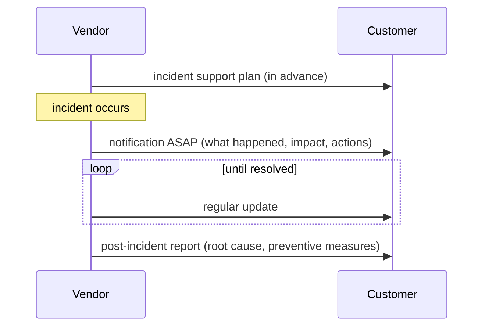
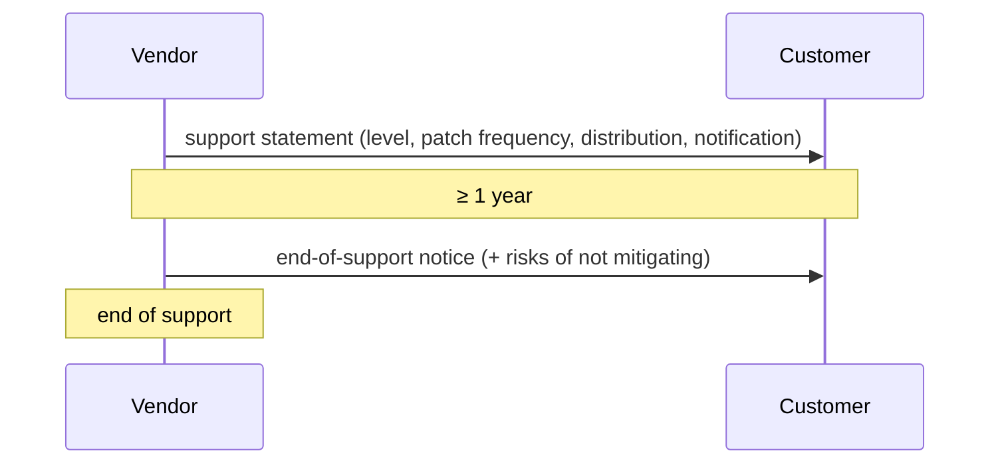

# Information-exchange flows — UK Software Security Code of Practice

These are obligations to exchange information between parties, not a wire protocol. Each message
and step, with its locator, is in `protocol.yaml`. The Code gives one quantitative timing only: at
least one year of notice before end of support (4.2). The sources do not fix the order of steps
5–8 relative to the fix; the order shown here is inferred.

## Vulnerability handling (3.2–3.5)

```mermaid
sequenceDiagram
  participant R as Researcher
  participant V as Vendor (incl. internal security team)
  participant C as Customer
  participant DB as CVE / NVD
  participant U as Third-party vendor
  participant G as Regulator
  R->>V: vulnerability report (via published VDP, confidential channel)
  V->>V: validate + triage → fix | acknowledge | investigate further
  V->>V: inform internal security teams
  alt fix
    V->>V: fix by priority (out-of-band if critical; temporary mitigation first allowed)
    V->>C: affected customers informed
    V->>DB: report to CVE
    opt affects third-party component
      V->>U: report to respective vendor
    end
    opt legal requirement
      V->>G: inform regulatory body
    end
    V->>C: signed, tested security update
    V->>C: notification (security update? temporary or full fix?)
    V->>V: root cause analysis
  else acknowledge
    V->>C: (notification decision; no fix)
  else investigate further
    V->>V: back to triage
  end
```

## Incident support (4.3)



## Support lifecycle (4.1–4.2)


