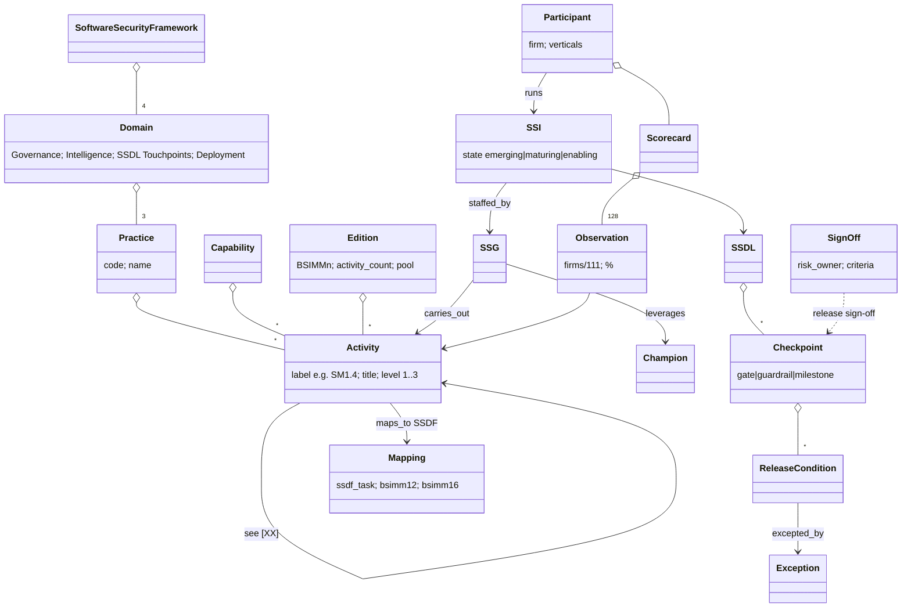

# BSIMM16 — object model

Source of truth: `object-model.yaml` (29 objects, 20 edges, each with locator;
`Score` and the absent `Evidence` edge are inferred).

**Findings for tmodel.** (1) BSIMM's `Checkpoint` (explicitly "gates, release
conditions, guardrails, milestones") + `ReleaseCondition` + tracked `Exception`
+ `SignOff` by a risk owner is the most concrete published description of the
R-041 Gate among the maturity models — but it lives in prose of three activities
(SM1.4, SM1.7, SM2.6), not as data. (2) Activity labels are edition-scoped and
relabelled when levels change, so crosswalk ids need edition qualification.
(3) The SSI state (emerging → maturing → enabling) is the program-level state;
activity levels are not states.
