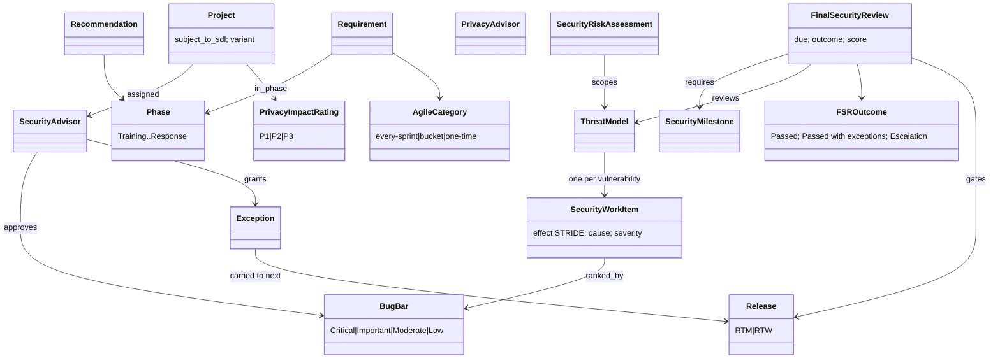

# Microsoft SDL 5.2 — object model

Source of truth `object-model.yaml` (29 objects, 17 edges). SDL 5.2 is the
richest Microsoft source for R-041: it has a named gate (FSR) with entry
milestones, an approver role, outcomes, exceptions and carry-over to the next
release.

**Findings.** (1) The FSR is a complete Gate: entry guard (milestones done,
information delivered), reviewer (security advisor), checks (threat models
reviewed for mitigation of all known threats; deferred bugs against the bug bar;
tool results), outcomes, waiver path, and post-gate debt. (2) "Create an
individual work item for each vulnerability listed in the threat model" is the
threat→mitigation→verification link tmodel automates. (3) The undefined
"security score of B" is a gap.
