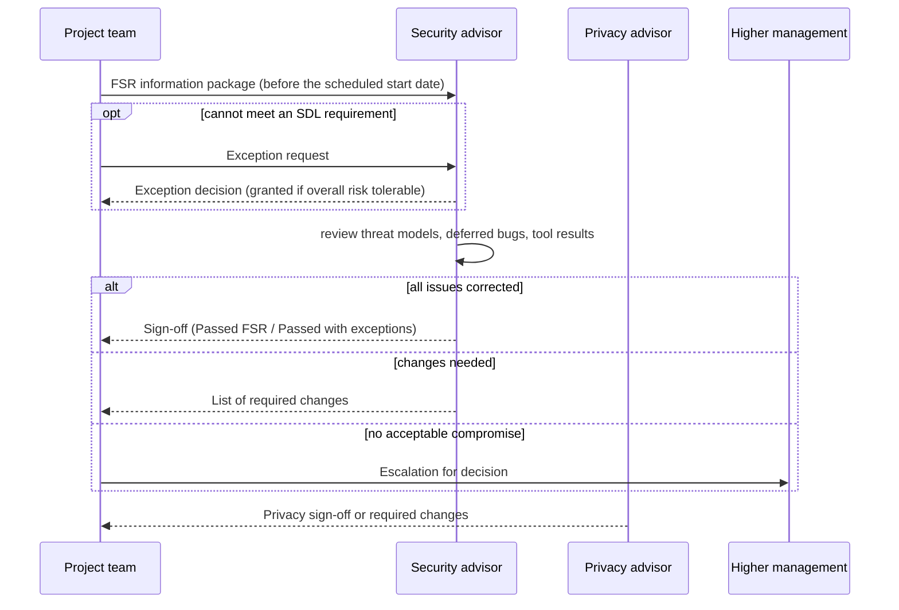

# SDL 5.2 — Final Security Review exchange

From Phase Five (FSR Process, Possible FSR Outcomes, Security/Privacy
Requirements); see `protocol.yaml` for the quoted text of each message.

```mermaid
sequenceDiagram
  participant T as Project team
  participant A as Security advisor
  participant P as Privacy advisor
  participant M as Higher management
  T->>A: FSR information package (before the scheduled start date)
  opt cannot meet an SDL requirement
    T->>A: Exception request
    A-->>T: Exception decision (granted if overall risk tolerable)
  end
  A->>A: review threat models, deferred bugs, tool results
  alt all issues corrected
    A-->>T: Sign-off (Passed FSR / Passed with exceptions)
  else changes needed
    A-->>T: List of required changes
  else no acceptable compromise
    T->>M: Escalation for decision
  end
  P-->>T: Privacy sign-off or required changes
```
