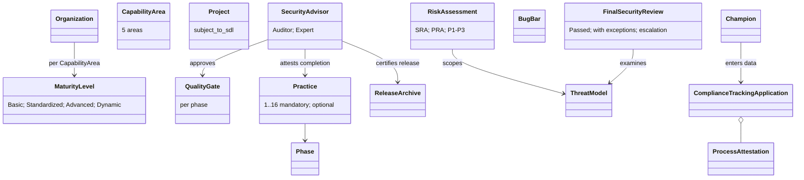

# Simplified SDL (2010) — object model

Source of truth `object-model.yaml` (24 objects, 9 edges).

**Findings.** Per-phase quality gates approved by an independent advisor
(Practice 3), an advisor who "attest[s] to successful completion of each
security requirement", and a central compliance-tracking application holding
process attestations are the 2010 precursors of R-041 Gates, R-042
conformance and R-043 "KG as source of truth".
