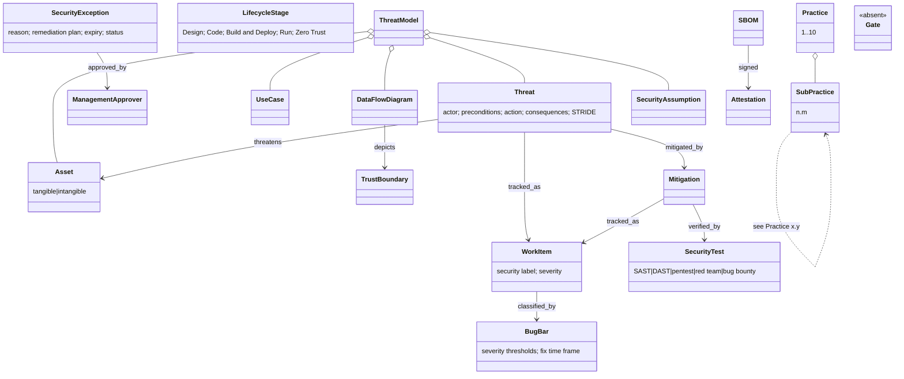

# Microsoft SDL (web practice set) — object model

Source of truth `object-model.yaml` (33 objects, 18 edges). The threat-modeling
core (practice 3) lines up almost one-to-one with tmodel's §1 layers; the
governance objects (bug bar, exception) feed R-041/R-042; there is **no gate**.

